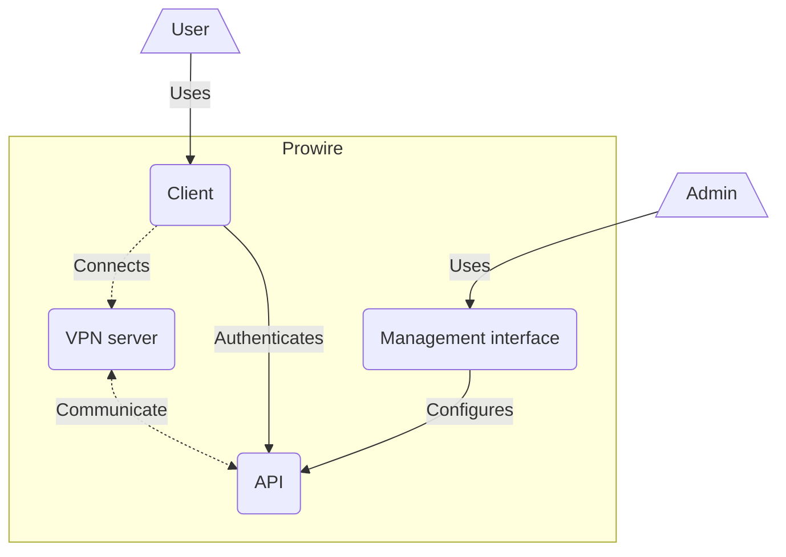

# Prowire

> [!WARNING]  
> 🏗 Prowire is currently under construction and no public release is available yet

Distributed corporate VPN made easy. Deploy VPN clusters easily, and manage your users and their access from a simple web interface. Your users can connect using one of our desktop (Windows / Mac / Linux) or mobile (Android / iOS) clients and authenticate using their corporate SSO.

## Understanding

This repository is the Prowire monorepo, which contains all of the different parts of Prowire.

### Architecture

Prowire is made of multiple softwares which work together in order to provider a complete service. They can all be found in different directories of this repository.

- `api`: Main prowire backend, this is where the core functionalities are implemented, such as user authentication or server management.
- `server`: The VPN server itself, it's a wrapper around an OpenVPN server which communicates with the Prowire backend.
- `client`: Client application used to connect a user's device to the VPN network.
- `management`: Management interface used by the system's administrators to manage their users and configure their clusters.

<i>Components of Prowire</i>

## Developing

Most of this repository is a monorepo of [npm workspaces](https://docs.npmjs.com/cli/v7/using-npm/workspaces). Therefore most actions can be done from the root directory specifying the workspace in which to run it to npm (ex: `npm run start -w api`).

Please reffer to each individual directories to see documentation on themselves.
