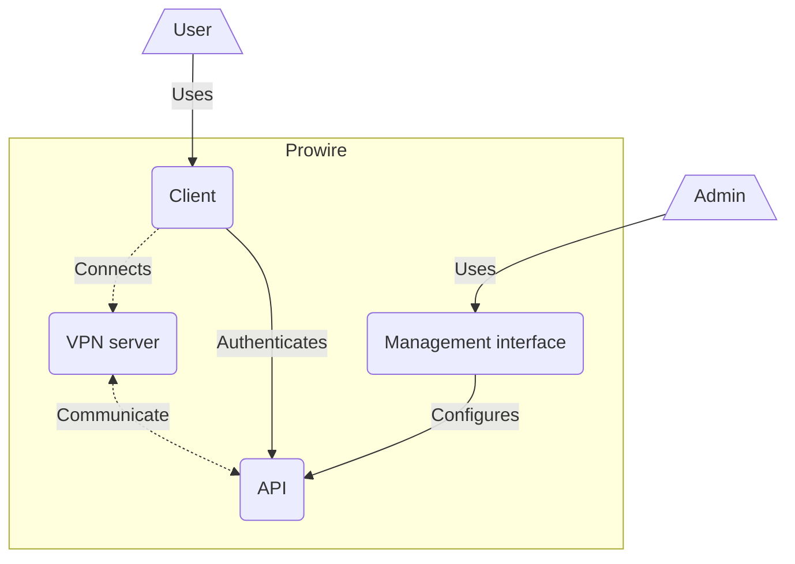

<p align="center">
    
</p>

# Prowire

> [!WARNING]  
> 🏗 Prowire is presently under development, and a public release is not yet available.

Prowire simplifies the deployment of VPN clusters for corporate use. With a user-friendly web interface, you can easily manage users and their access. Your users can connect using our desktop (Windows / Mac / Linux) or mobile (Android / iOS) clients and authenticate using their corporate Single Sign-On (SSO) credentials.

## Understanding

This repository is the Prowire monorepo, housing all components of the Prowire system.

### Architecture

Prowire is composed of various software components that collaborate to deliver a comprehensive service. These components are organized within subdirectories under the `apps` directory in this repository:

- `api`: The primary Prowire backend, responsible for core functionalities like user authentication and server management.
- `server`: The VPN server itself, functioning as a wrapper around an OpenVPN server, communicating with the Prowire backend.
- `client`: A client application for connecting users' devices to the VPN network.
- `management`: A management interface for system administrators to manage users and configure their clusters


<p align="center"><i>Prowire components</i></p>

For detailed documentation on individual components, please refer to their respective directories.

---

## Developing

This repository operates as a monorepo using [npm workspaces](https://docs.npmjs.com/cli/v7/using-npm/workspaces) and is orchestrated with [NX](https://nx.dev/) as the build system. NX efficiently manages dependencies and execution of tasks within this monorepo.

### Dependencies

To install all package dependencies for regular development, use the following command:

```bash
npm ci --workspaces --include-workspace-root
```

### Testing

#### Strategy

Prowire currently employs two levels of testing: unit tests and integration tests. Both types of tests are executed using [Jest](https://jestjs.io/fr/). Unit tests focus on testing functions, relying on abstractions through mocking and stubbing while running in isolation. In contrast, integration tests assess the entire system with certain dependencies available (such as MongoDB and Redis), typically used to test the data layer and perform functional API tests.

#### Implementation

All tests are colocated with the code they are testing, identified by the .test.ts file extension. For example, a file named `user.service.ts` would have its corresponding tests in `user.service.test.ts` within the same directory.

Integration tests are identified with a JSDoc annotation, as illustrated in the following example. Any test file lacking this annotation is considered a unit test.

```typescript
/**
 * Tests UserRepository class
 * @group integration
 */
describe('UserRepository', () => {
    // Some tests...
});
```

#### Running unit tests

You have multiple methods to run unit tests depending on your goals:

```bash
# Run all tests
npx nx run-many -t test

# Run tests only for code that differs from main or is impacted by changes in the dependency graph
npx nx affected -t test

# Run tests for a specific application or library (e.g., api)
npx nx run test api

# Run tests for a specific file within an application or library (e.g., api)
npx nx run test api -- src/organization/domain/user.service.test.ts
```

#### Running integration tests

First, ensure that you have the necessary dependencies running locally. The easiest approach is to launch the development Docker Compose stack:

```bash
docker compose -f compose.dev.yml up -d
```

You have multiple methods to run integration tests depending on your goals:

```bash
# Run all tests
npx nx run-many -t integration

# Run tests only for code that differs from main or is impacted by changes in the dependency graph
npx nx affected -t integration

# Run tests for a specific application or library (e.g., api)
npx nx run integration api

# Run tests for a specific file within an application or library (e.g., api)
npx nx run integration api -- src/organization/infrastructure/user.repository.test.ts
```
