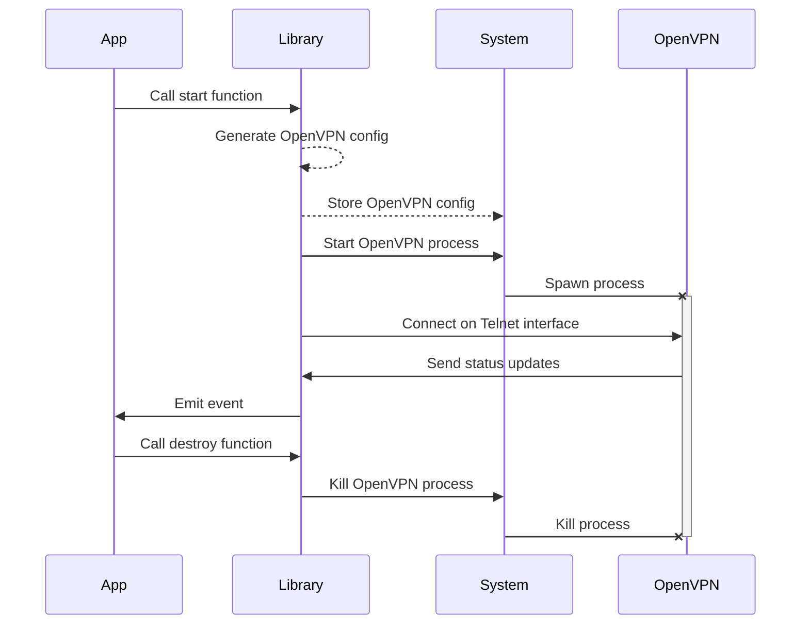

# Prowire OpenVPN library

📖 [Technical documentation](https://prowire-vpn.github.io/prowire/libs/openvpn/)

The Prowire OpenVPN Library is a versatile tool for managing and communicating with [OpenVPN](https://openvpn.net/) processes. For client or server use cases, this library offers three core functions:

- **Process Management**: It efficiently spawns and manages OpenVPN processes, ensuring stability and resource optimization.
- **Configuration File Generation**: Easily convert specified parameters into an organized [OpenVPN configuration file](https://openvpn.net/community-resources/reference-manual-for-openvpn-2-4/), securely stored in a temporary directory.
- **Telnet Interface Integration**: Seamlessly connect to the [OpenVPN management interface](https://openvpn.net/community-resources/management-interface/) via a Telnet client, facilitating control and monitoring of OpenVPN processes.

For a visual representation of the library's workflow, refer to the diagram below:

